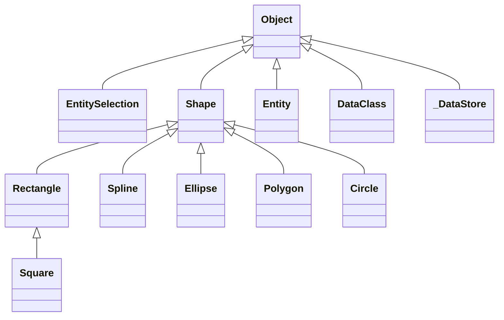

# ClassStoreDiagram
[![language][code-shield]][code-url]
[![language-top][code-top]][code-url]
![code-size][code-size]
[![release][release-shield]][release-url]
[![license][license-shield]][license-url]

Create class diagram for your class store

## Usage

### Get the diagram passing your cs

Choose a format between [mermaid](https://mermaid-js.github.io/mermaid/) and [graphiz dot](http://graphviz.org/)

```4d
$diagram:=csDiagram(cs).mermaid()
$diagram:=csDiagram(cs).dot()
```

### Get the diagram raw source

```4d
$txtSource:=$diagram.source
```

### Get an svg 

### using the remote service kroki.io

[kroki.io](https://kroki.io/) is a free service to convert diagrams to images. (It can be self hosted)

```4d
$diagram.kroki().svg
```

### using a web page

Copy paste the diagram source into this online service

- mermaid: https://mermaid-js.github.io/mermaid-live-editor
- graphviz: https://dreampuf.github.io/GraphvizOnline/

You could also make your own converter like this [example](Examples/WebGraph) using js libraries.

### Install softwares

Alternatively you can install cli tools to convert diagrams.

## Result for the provide example base

[WebGraph database](Examples/WebGraph) contains some shape classes.

The result of code

```4d
csGraph(cs).mermaid().source
```

is

[](https://mermaid-js.github.io/mermaid-live-editor/#/edit/eyJjb2RlIjoiY2xhc3NEaWFncmFtXG5cdGNsYXNzIFNxdWFyZSB7XG5cdH1cblx0Y2xhc3MgUmVjdGFuZ2xlIHtcblx0fVxuXHRjbGFzcyBTcGxpbmUge1xuXHR9XG5cdGNsYXNzIEVsbGlwc2Uge1xuXHR9XG5cdGNsYXNzIEVudGl0eVNlbGVjdGlvbiB7XG5cdH1cblx0Y2xhc3MgU2hhcGUge1xuXHR9XG5cdGNsYXNzIFBvbHlnb24ge1xuXHR9XG5cdGNsYXNzIENpcmNsZSB7XG5cdH1cblx0Y2xhc3MgRW50aXR5IHtcblx0fVxuXHRjbGFzcyBEYXRhQ2xhc3Mge1xuXHR9XG5cdGNsYXNzIF9EYXRhU3RvcmUge1xuXHR9XG5SZWN0YW5nbGUgPHwtLSBTcXVhcmVcblNoYXBlIDx8LS0gUmVjdGFuZ2xlXG5TaGFwZSA8fC0tIFNwbGluZVxuU2hhcGUgPHwtLSBFbGxpcHNlXG5PYmplY3QgPHwtLSBFbnRpdHlTZWxlY3Rpb25cbk9iamVjdCA8fC0tIFNoYXBlXG5TaGFwZSA8fC0tIFBvbHlnb25cblNoYXBlIDx8LS0gQ2lyY2xlXG5PYmplY3QgPHwtLSBFbnRpdHlcbk9iamVjdCA8fC0tIERhdGFDbGFzc1xuT2JqZWN0IDx8LS0gX0RhdGFTdG9yZVxuXG4iLCJtZXJtYWlkIjp7InRoZW1lIjoiZGVmYXVsdCJ9LCJ1cGRhdGVFZGl0b3IiOmZhbHNlfQ)



<!-- MARKDOWN LINKS & IMAGES -->
<!-- https://www.markdownguide.org/basic-syntax/#reference-style-links -->
[code-shield]: https://img.shields.io/static/v1?label=language&message=4d&color=blue
[code-top]: https://img.shields.io/github/languages/top/mesopelagique/ClassStoreDiagram.svg
[code-size]: https://img.shields.io/github/languages/code-size/mesopelagique/ClassStoreDiagram.svg
[code-url]: https://developer.4d.com/
[release-shield]: https://img.shields.io/github/v/release/mesopelagique/ClassStoreDiagram
[release-url]: https://github.com/mesopelagique/ClassStoreDiagram/releases/latest
[license-shield]: https://img.shields.io/github/license/mesopelagique/ClassStoreDiagram
[license-url]: LICENSE.md
